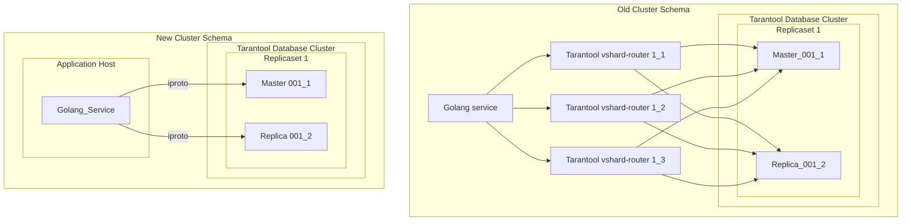
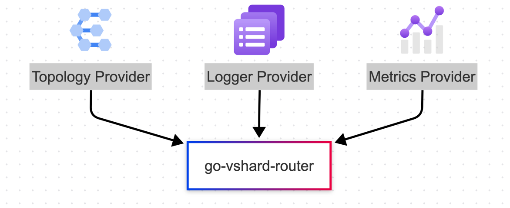

# Go VShard Router


[](https://pkg.go.dev/github.com/tarantool/go-vshard-router)
[![Actions Status][actions-badge]][actions-url]
[](https://goreportcard.com/report/github.com/tarantool/go-vshard-router)
[![Code Coverage][coverage-badge]][coverage-url]
[](https://raw.githubusercontent.com/KaymeKaydex/go-vshard-router/master/LICENSE)

Translations:
- [Русский](https://github.com/tarantool/go-vshard-router/blob/master/README_ru.md)


go-vshard-router is a library for sending requests to a sharded tarantool cluster directly,
without using tarantool-router. This library based on [tarantool vhsard library router](https://github.com/tarantool/vshard/blob/master/vshard/router/init.lua) and [go-tarantool connector](https://github.com/tarantool/go-tarantool). go-vshard-router takes a new approach to creating your cluster



## Getting started
### Prerequisites

- **[Go](https://go.dev/)**: any one of the **two latest major** [releases](https://go.dev/doc/devel/release) (we test it with these).

### Getting Go-Vshard-Router
With [Go module](https://github.com/golang/go/wiki/Modules) support, simply add the following import

```
import "github.com/tarantool/go-vshard-router/v2"
```
to your code, and then `go [build|run|test]` will automatically fetch the necessary dependencies.

Otherwise, run the following Go command to install the `go-vshard-router` package:

```sh
$ go get -u github.com/tarantool/go-vshard-router/v2
```

### Running Go-Vshard-Router

First you need to import Go-Vshard-Router package for using Go-Vshard-Router

```go
package main

import (
  "context"
  "fmt"
  "strconv"
  "time"

  vshardrouter "github.com/tarantool/go-vshard-router/v2"
  "github.com/tarantool/go-vshard-router/v2/providers/static"

  "github.com/google/uuid"
  "github.com/tarantool/go-tarantool/v2"
)

func main() {
  ctx := context.Background()

  directRouter, err := vshardrouter.NewRouter(ctx, vshardrouter.Config{
    DiscoveryTimeout: time.Minute,
    DiscoveryMode:    vshardrouter.DiscoveryModeOn,
    TopologyProvider: static.NewProvider(map[vshardrouter.ReplicasetInfo][]vshardrouter.InstanceInfo{
      {Name: "replcaset_1", UUID: uuid.New()}: {
        {Addr: "127.0.0.1:1001", Name: "1_1"},
        {Addr: "127.0.0.1:1002", Name: "1_2"},
      },
      {Name: "replcaset_2", UUID: uuid.New()}: {
        {Addr: "127.0.0.1:2001", Name: "2_1"},
        {Addr: "127.0.0.1:2002", Name: "2_2"},
      },
    }),
    TotalBucketCount: 128000,
    PoolOpts: tarantool.Opts{
      Timeout: time.Second,
    },
  })
  if err != nil {
    panic(err)
  }

  user := struct {
    ID uint64
  }{
    ID: 123,
  }

  bucketID := directRouter.BucketIDStrCRC32(strconv.FormatUint(user.ID, 10))

  resp, err := directRouter.Call(
    ctx,
    bucketID,
    vshardrouter.CallModeBRO,
    "storage.api.get_user_info",
    []interface{}{&struct {
      BucketID uint64                 `msgpack:"bucket_id" json:"bucket_id,omitempty"`
      Body     map[string]interface{} `msgpack:"body"`
    }{
      BucketID: bucketID,
      Body: map[string]interface{}{
        "user_id": "123456",
      },
    }}, vshardrouter.CallOpts{Timeout: time.Second * 2},
  )
  if err != nil {
    panic(err)
  }

  info := &struct {
    BirthDay int
  }{}

  err = resp.GetTyped(&[]interface{}{info})
  if err != nil {
    panic(err)
  }

  interfaceResult, err := resp.Get()
  if err != nil {
    panic(err)
  }

  fmt.Printf("interface result: %v", interfaceResult)
  fmt.Printf("get typed result: %v", info)
}
```
### Providers


We understand that the implementations of loggers, metrics,
and topology sources can vary significantly in both implementation and usage.
Therefore, go-vshard-router gives you the flexibility to choose the tools you deem appropriate
or implement them yourself by using interfaces.

#### Topology
You can use topology (configuration) providers as the source of router configuration.  
Currently, the following providers are supported:

- **etcd** (for configurations similar to [moonlibs/config](https://github.com/moonlibs/config?tab=readme-ov-file#example-of-etcd-configuration-for-vshard-based-applications-etcdclustervshard) in etcd v2 for Tarantool versions below 3)
- **static** (for specifying configuration directly in the code for ease of testing)
- **[viper](providers/viper/README.md)**
  - etcd v3
  - consul
  - files

#### Metrics
Metrics providers are also available,
you can use ready-made metrics providers that can be registered in prometheus and passed to go-vshard-router.
This will allow you not to think about options and metrics settings.
The following providers are currently available:
- **[prometheus](providers/prometheus)**

#### Logs

- stdout (builtin)
- **[slog](providers/slog)**

### Learn more examples
#### Quick Start
Learn with th [Quick Start](docs/doc.md), which include  examples and theory.
#### [Customer service](examples/customer/README.md)
Service with go-vshard-router on top of the tarantool example from the original vshard library using raft

## Benchmarks
### Go Bench

| Benchmark                             | Runs   | Time (ns/op) | Memory (B/op) | Allocations (allocs/op) |
|---------------------------------------|--------|---------------|----------------|-------------------------|
| BenchmarkCallSimpleInsert_GO-12       | 14929  | 77443        | 2308           | 34                      |
| BenchmarkCallSimpleInsert_Lua-12      | 10196  | 116101       | 1098           | 19                      |
| BenchmarkCallSimpleSelect_GO-12       | 20065  | 60521        | 2534           | 40                      |
| BenchmarkCallSimpleSelect_Lua-12      | 12064  | 99874        | 1153           | 20                      |


### [K6](https://github.com/grafana/k6)
Topology:
- 4 replicasets (x2 instances per rs)
- 4 tarantool proxy
- 1 golang service

constant VUes scenario:
at a load close to production

```select```
- go-vshard-router: uncritically worse latency, but 3 times more rps
  
- tarantool-router: (80% cpu, heavy rps kills proxy at 100% cpu) 
  


[actions-badge]: https://github.com/tarantool/go-vshard-router/actions/workflows/main.yml/badge.svg
[actions-url]: https://github.com/tarantool/go-vshard-router/actions/workflows/main.yml
[coverage-badge]: https://coveralls.io/repos/github/tarantool/go-vshard-router/badge.svg?branch=master
[coverage-url]: https://coveralls.io/github/tarantool/go-vshard-router?branch=master