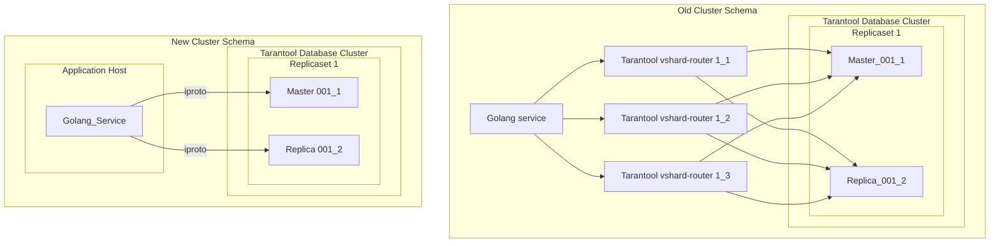

# Go VShard Router


[](https://pkg.go.dev/github.com/tarantool/go-vshard-router)
[![Actions Status][actions-badge]][actions-url]
[](https://goreportcard.com/report/github.com/tarantool/go-vshard-router)
[![Code Coverage][coverage-badge]][coverage-url]
[](https://raw.githubusercontent.com/KaymeKaydex/go-vshard-router/master/LICENSE)

Translations:
- [English](https://github.com/tarantool/go-vshard-router/blob/main/README.md)

go-vshard-router — библиотека для отправки запросов напрямую в стораджа в шардированный кластер tarantool,
без использования tarantool-router.  Эта библиотека написана на основе [модуля библиотеки tarantool vhsard router](https://github.com/tarantool/vshard/blob/master/vshard/router/init.lua) и [коннектора go-tarantool](https://github.com/tarantool/go-tarantool). go-vshard-router применяет новый подход к созданию кластера



## Как начать использовать?
### Предварительные условия

- **[Go](https://go.dev/)**: любая из **двух последних мажорных версий** [releases](https://go.dev/doc/devel/release).

### Установка Go-Vshard-Router
С помощью [Go module](https://github.com/golang/go/wiki/Modules) можно добавить следующий импорт

```
import "github.com/tarantool/go-vshard-router"
```
в ваш код, а затем `go [build|run|test]` автоматически получит необходимые зависимости.


В противном случае выполните следующую команду Go, чтобы установить пакет go-vshard-router:
```sh
$ go get -u github.com/tarantool/go-vshard-router
```

### Использование Go-Vshard-Router

Сначала вам необходимо импортировать пакет go-vshard-router для его использования.

```go
package main

import (
  "context"
  "fmt"
  "strconv"
  "time"

  vshardrouter "github.com/tarantool/go-vshard-router"
  "github.com/tarantool/go-vshard-router/providers/static"

  "github.com/google/uuid"
  "github.com/tarantool/go-tarantool/v2"
)

func main() {
  ctx := context.Background()

  directRouter, err := vshardrouter.NewRouter(ctx, vshardrouter.Config{
    DiscoveryTimeout: time.Minute,
    DiscoveryMode:    vshardrouter.DiscoveryModeOn,
    TopologyProvider: static.NewProvider(map[vshardrouter.ReplicasetInfo][]vshardrouter.InstanceInfo{
      vshardrouter.ReplicasetInfo{
        Name: "replcaset_1",
        UUID: uuid.New(),
      }: {
        {
          Addr: "127.0.0.1:1001",
          Name: "1_1",
        },
        {
          Addr: "127.0.0.1:1002",
          Name: "1_2",
        },
      },
      vshardrouter.ReplicasetInfo{
        Name: "replcaset_2",
        UUID: uuid.New(),
      }: {
        {
          Addr: "127.0.0.1:2001",
          Name: "2_1",
        },
        {
          Addr: "127.0.0.1:2002",
          Name: "2_2",
        },
      },
    }),
    TotalBucketCount: 128000,
    PoolOpts: tarantool.Opts{
      Timeout: time.Second,
    },
  })
  if err != nil {
    panic(err)
  }

  user := struct {
    ID uint64
  }{
    ID: 123,
  }

  bucketID := vshardrouter.BucketIDStrCRC32(strconv.FormatUint(user.ID, 10), directRouter.RouterBucketCount())

  resp, err := directRouter.Call(
    ctx,
    bucketID,
    vshardrouter.CallModeBRO,
    "storage.api.get_user_info",
    []interface{}{&struct {
      BucketID uint64                 `msgpack:"bucket_id" json:"bucket_id,omitempty"`
      Body     map[string]interface{} `msgpack:"body"`
    }{
      BucketID: bucketID,
      Body: map[string]interface{}{
        "user_id": "123456",
      },
    }}, vshardrouter.CallOpts{Timeout: time.Second * 2},
  )
  if err != nil {
    panic(err)
  }

  info := &struct {
    BirthDay int
  }{}

  err = resp.GetTyped(&[]interface{}{info})
  if err != nil {
    panic(err)
  }

  interfaceResult, err := resp.Get()
  if err != nil {
    panic(err)
  }

  fmt.Printf("interface result: %v", interfaceResult)
  fmt.Printf("get typed result: %v", info)
}
```

### Провайдеры
Как источник конфигурации вы можете использовать провайдеры топологии(конфигурации).
На данный момент есть поддержка следующих провайдеров:
- **etcd** (для конфигурации аналогичной [moonlibs/config](https://github.com/moonlibs/config?tab=readme-ov-file#example-of-etcd-configuration-for-vshard-based-applications-etcdclustervshard) в etcd v2 для tarantool версии ниже 3)
- **static** (для указания конфигурации прямо из кода и простоты тестирования)
- **[viper](providers/viper/README.md)**
  - etcd v3
  - consul
  - files

### Ознакомьтесь с другими примерами
#### Быстрое начало
Познакомьтесь с  [Полной документацией](docs/doc_ru.md), которая включает в себя примеры и теорию.
#### [Customer service](examples/customer/README.ru.md)
Сервис с go-vshard-router поверх примера тарантула из оригинальной библиотеки vshard с использованием raft.

## Бенчмарки
### Go Bench

| Бенчмарк                         | Число запусков | Время (ns/op) | Память (B/op) | Аллокации (allocs/op) |
|---------------------------------------|--------|---------------|----------------|-------------------------|
| BenchmarkCallSimpleInsert_GO-12       | 14216  | 81118         | 1419           | 29                      |
| BenchmarkCallSimpleInsert_Lua-12      | 9580   | 123307        | 1131           | 19                      |
| BenchmarkCallSimpleSelect_GO-12       | 18832  | 65190         | 1879           | 38                      |
| BenchmarkCallSimpleSelect_Lua-12      | 9963   | 104781        | 1617           | 28                      |
| BenchmarkRouter_Call_Select_SyncPool-12 | 19956  | 60924         | 1848           | 36                      |

### [K6](https://github.com/grafana/k6)

Топология:
- 4 репликасета (x2 инстанса на репликасет)
- 4 тарантул прокси
- 1 инстанс гошного сервиса

сценарий constant VUes:
в нагрузке близкой к продовой

```select```
- go-vshard-router: uncritically worse latency, but 3 times more rps
  
- tarantool-router: (80% cpu, heavy rps kills proxy at 100% cpu)
  


[actions-badge]: https://github.com/tarantool/go-vshard-router/actions/workflows/main.yml/badge.svg
[actions-url]: https://github.com/tarantool/go-vshard-router/actions/workflows/main.yml
[coverage-badge]: https://coveralls.io/repos/github/tarantool/go-vshard-router/badge.svg?branch=master
[coverage-url]: https://coveralls.io/github/tarantool/go-vshard-router?branch=master