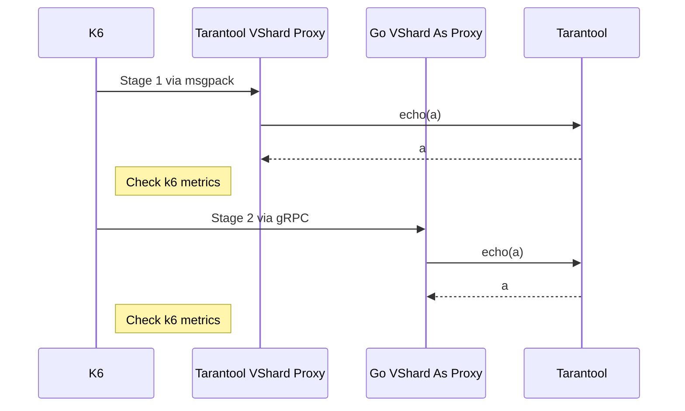

# Bench

## Grafana
```
Login:    admin
Password: secret
```


### Sequence

```mermaid
sequenceDiagram
    participant K6
    participant LuaProxy as Tarantool VShard Proxy
    participant GoProxy as Go VShard As Proxy
    participant Tarantool

    K6->>LuaProxy: Stage 1 via msgpack
    LuaProxy->>Tarantool: echo(a)
    Tarantool-->>LuaProxy: a

    Note right of K6: Check k6 metrics

    K6->>GoProxy: Stage 2 via gRPC
    GoProxy->>Tarantool: echo(a)
    Tarantool-->>GoProxy: a

    Note right of K6: Check k6 metrics
```